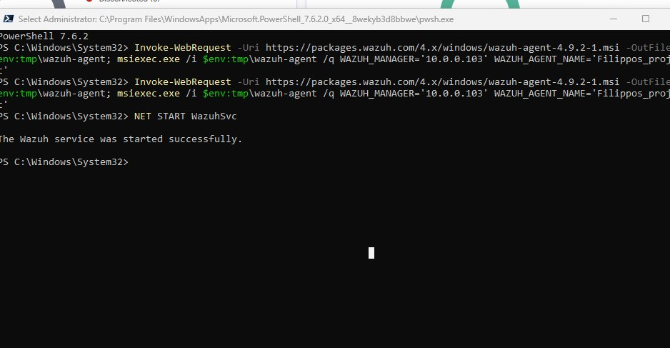
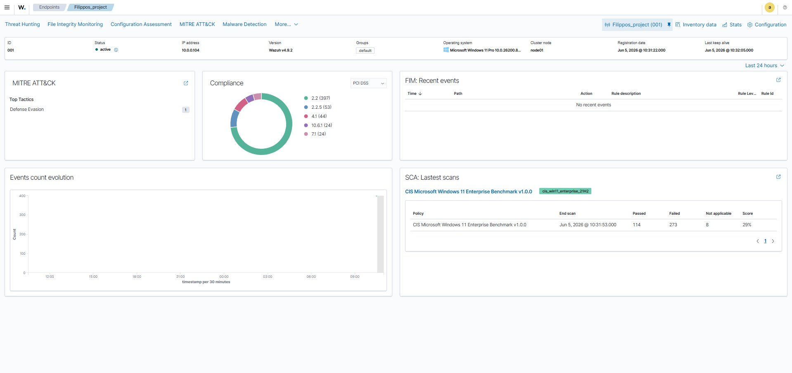
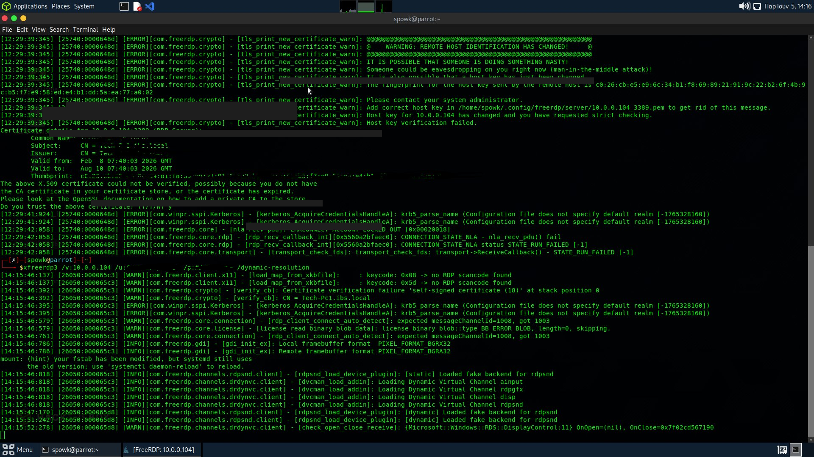
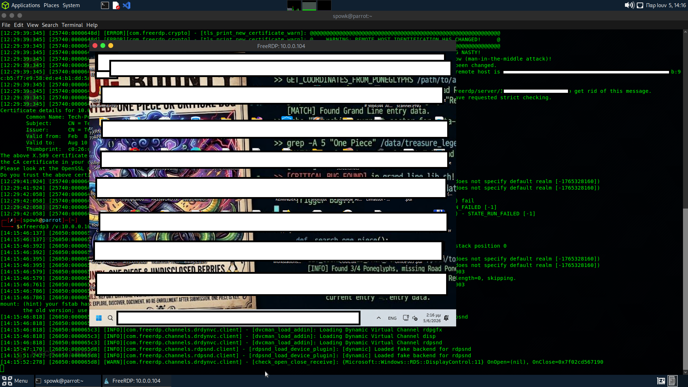
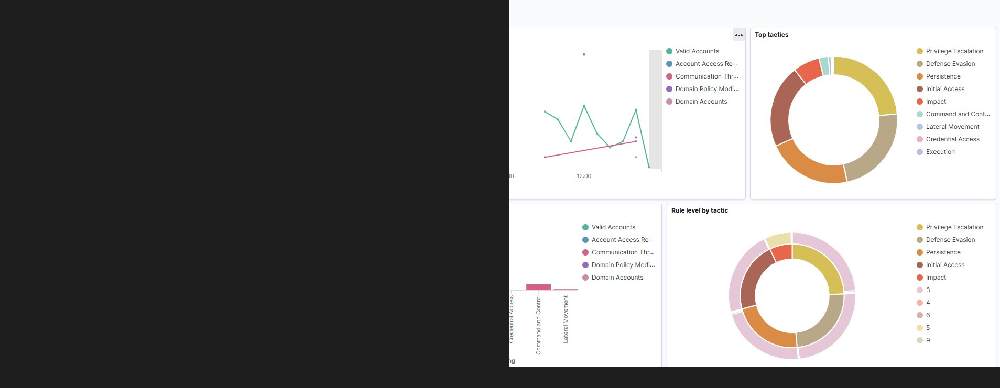
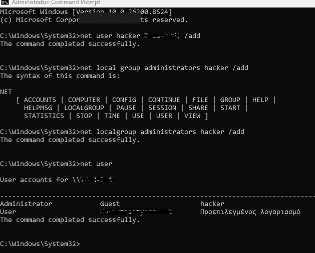
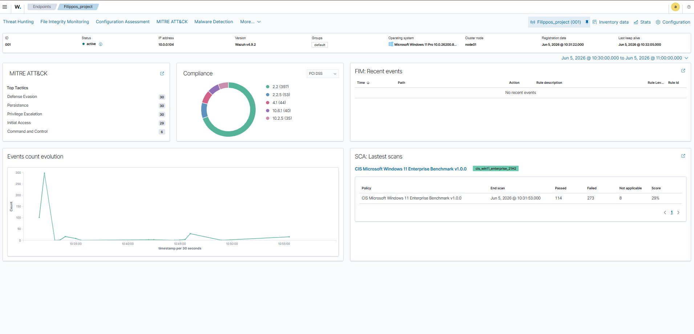
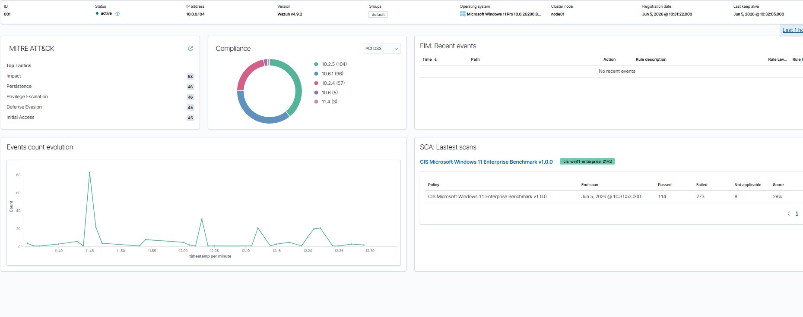
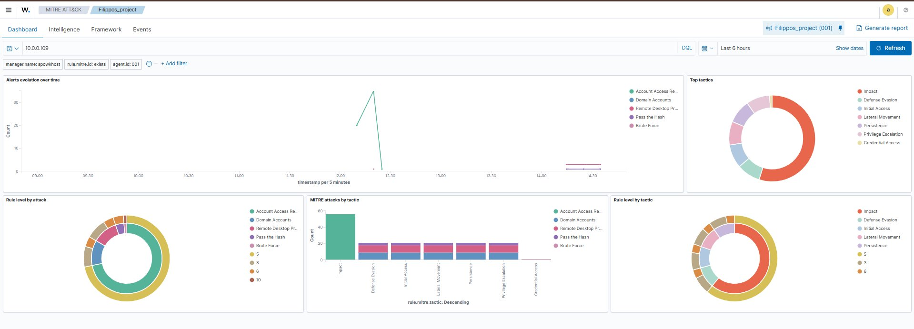
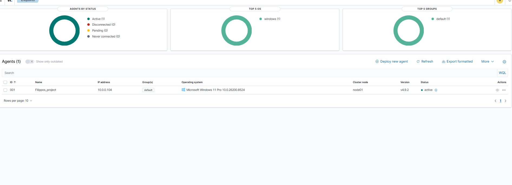

# The-Red-The-Blue-The-Builder

### ⚠️ Privacy & Security Disclaimer
For security and anonymity purposes, sensitive data including domain names, passwords, specific usernames, and unapproved IP addresses have been redacted from all reports and screenshots.

### Project Description
A comprehensive home lab project covering Red Team operations, Blue Team monitoring, and infrastructure building using Wazuh SIEM.

### 🏗️ The Builder (Infrastructure & Hardware)
* **Wazuh SIEM Manager:** Hosted on an Intel NUC running Ubuntu (10.0.0.103).
* **Attacker Machine (Red Team):** Hosted on a secondary Intel NUC running Parrot OS (10.0.0.109).
* **Victim Endpoint & SOC Monitor:** A Dell Optiplex 3070 running Windows 11 (10.0.0.104).

### 🔴 The Red (Offensive Operations)
* **Reconnaissance:** Network enumeration using Nmap.

* **Initial Access:** RDP brute-force and remote access via xfreerdp.

* **Persistence & Privilege Escalation:** Adding a rogue local administrator account.

### 🔵 The Blue (Defensive Operations)
* **Wazuh Monitoring:** Real-time detection of brute-force and account modifications.

* **Threat Intelligence:** Mapping activity to MITRE ATT&CK.

* **Vulnerability & Compliance:** Performing System Configuration Assessment (SCA).

### 📊 Security Incident Report
This repository includes a raw exported log file (`report.csv`) extracted from the Wazuh SIEM. 
👉 **[Click here to view the full report.csv](report.csv)**
